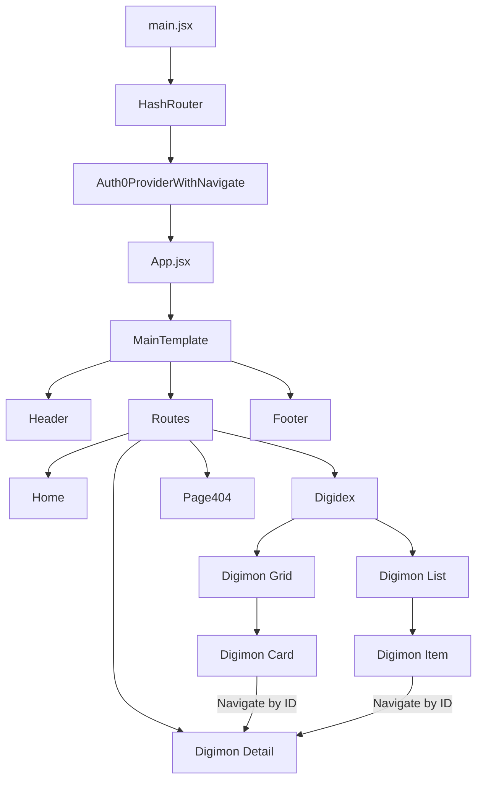

# Digidèx

This project aims to facilitate the discovery of Digimon characters through a Web App, built primarily using **React**. It can be defined as a digital encyclopedia dedicated to the Digimon universe, where users can view, filter, and explore various characters.

### Technologies Used

To build this project, React was used alongside several essential and complementary technologies:

* **Vite**: A build tool that provides a fast development environment and scaffolds the Single Page Application (SPA).
* **Auth0**: A service used to implement secure authentication and login functionality within the application.
* **react-router-dom**: A library for managing navigation and routing within the web app.
* **Reactstrap**: A library that allows the integration of Bootstrap components into the React environment.
* **GitHub Pages**: The hosting service used to deploy the project and make it accessible online.

### Key Features

* **Dynamic Catalog**: Browse a vast list of Digimon with real-time data fetched directly from the official API.
* **Advanced Filtering**: Search for specific Digimon by name or filter them by attributes such as Vaccine, Data, Virus, and more.
* **Secure Access**: Sensitive information and detailed views are protected via **Auth0** authentication, ensuring that only logged-in users can access specific content.
* **Responsive Design**: A fully mobile-friendly interface built with **Reactstrap**, providing a seamless experience across all devices.
* **Automated Deployment**: Integrated CI/CD pipeline using **GitHub Actions** for fast and reliable updates.

## Initialization

First, I created a directory to house the entire project. After opening it in the IDE, I initialized the environment 
with **Vite** using the following command:

```bash
npm create vite@latest digimon-app -- --template react

```
Once the process was complete, I navigated into the newly created folder and ran npm install to set up the project's core dependencies. 
Subsequently, I used npm to install the specific libraries required for the application's functionality:
```bash
cd my-digimon-app
npm install
npm install react-router-dom
npm install @auth0/auth0-react
npm install bootstrap reactstrap
npm install gh-pages --save-dev
```
Once these installations were finished, I immediately created a **GitHub repository** to save my project, 
enable online hosting, and share my work. I then linked the local code to the repository using Git commands

## Project Structure
The project follows a modular architecture inspired by the MVVM (Model-View-ViewModel) paradigm. 
This structure ensures that the code is organized, maintainable, and perfectly suited for a modern Web App.
```Plaintext
digimon-app/
├── .github/workflows/   # CI/CD pipelines for automated deployment
├── public/              # Static public assets
├── src/
│   ├── assets/          # Global images (404, background, home, logos)
│   ├── auth/            # Authentication logic and providers
│   │   ├── Auth0ProviderWithNavigate.jsx
│   │   └── ProtectedRoute.jsx
│   ├── components/      # Reusable UI components in atomic folders
│   │   ├── DigimonCard/   # Card component with scoped CSS
│   │   ├── DigimonGrid/   # Grid layout logic
│   │   ├── DigimonItem/   # Individual list items
│   │   ├── DigimonList/   # List layout logic
│   │   ├── Footer/        # Application Footer
│   │   ├── Header/        # Application Header
│   │   ├── LoginButton/   # Styled Login trigger
│   │   ├── LogoutButton/  # Styled Logout trigger
│   │   ├── MainTemplate/  # Global layout wrapper
│   │   └── UserProfile/   # User session display
│   ├── utility/         # API fetching logic and helper functions
│   ├── views/           # Main application pages
│   │   ├── App/           # Core App logic
│   │   ├── Digidex/       # Main catalog view
│   │   ├── DigimonDetail/ # Detailed info view
│   │   ├── Home/          # Welcome landing page
│   │   └── Page404/       # Custom 404 error page
│   ├── index.css        # Global styles
│   └── main.jsx         # Application entry point
├── .env                 # Environment variables (Auth0 keys)
├── vite.config.js       # Vite build and base path configuration
└── package.json         # Project metadata and dependencies 
```

### Application flow



## Technical Choices

### Handle the redirect URI for login / logout

To streamline the login and logout processes, I implemented conditional logic to distinguish between the local 
development environment (localhost) and the live production site. For the Auth0 authentication flow, I defined a dynamic 
redirectUri to ensure users are always returned to the correct location after an action:

```JavaScript
const redirectUri = window.location.hostname === 'localhost'
        ? window.location.origin
        : 'https://marcottolina.github.io/digidex/';
```

### User profile icon 

While integrating Auth0, I implemented a custom user icon in the header to represent the authenticated session. Originally, 
I intended to display the user's profile picture directly from the Auth0 metadata. However, I noticed that these external 
images would occasionally fail to load or revert to a generic placeholder, creating an inconsistent visual experience. 
To solve this and to achieve a more cohesive aesthetic—I pivoted to a dynamic letter avatar.  When a user logs in, 
the application now generates a minimalist circular icon displaying the first initial of their name in black text on a 
white background. This ensures a fast, reliable, and stylish UI element that never fails to render.

```JavaScript
//Render the first character of the user's name
return (
    <div className="d-flex justify-content-center align-items-center">
        <div className={style.avatarCircle}
            title={user.name}
        >
            {user.name ? (
            user.name.charAt(0).toUpperCase()
            ) : (
            "?"
        )}
        </div>
    </div>
);
```

### Search section

The "Digidex" page features a dynamic search bar that allows users to find specific Digimon in real-time. 
As the user types in the input field, the application provides up to **10 suggestions** to help them find the correct name more quickly. 

To provide a seamless experience, the content of the page updates **automatically** as the user types. 
There is no need to manually click a search button; the results are filtered "live" to reflect the current query. 
Users can further refine their search by filtering Digimon based on their specific attributes: *Vaccine*, *Data*, *Virus*, *Free*, and *Variable*.

The search functionality is triggered by the onChange event, which initiates an API call to fetch Digimon with names matching the search query. 
While the search is instantaneous, I made specific design choices to ensure user comfort:
- **Suggestion Management**: When the user presses the Enter key or clicks the "Search" button, the suggestion list is hidden to clear the interface.
- **Intuitive Controls**: Even though the search is live, I decided to keep the "Search" button and the "Enter" key functionality. This prevents user confusion, as many people are accustomed to confirming their search manually.

```JavaScript
<Input
    type="search"
    list="suggestions"
    placeholder="Search Digimon"
    onChange={(e) => {
        setName(e.target.value);
        filteredData(e.target.value, attribute);
    }}
    onKeyDown={(e) => {
        if (e.key === 'Enter') setSuggestions([]);
    }}
/>
```

### Data Management (Model)

The `utility/Utility.js` file acts as the Model layer of the application. It centralizes all communication with the Digimon 
API, ensuring that data fetching logic is decoupled from the UI components.

- **getDetailsById(id)**: Fetches the complete profile of a specific Digimon. It retrieves a rich JSON object including names, images, levels, types and multilingual descriptions.
- **getMaxID()**: A utility function that retrieves the total number of Digimon available in the database. This value is critical for calculating navigation boundaries and preventing users from clicking "Next" beyond the existing data.
- **getDigimonFiltered(name, attribute, page)**: The "engine" behind the search bar and catalog. It dynamically builds a query string using URLSearchParams to handle three variables simultaneously:
  - **Name**: the name of the Digimon
  - **Attribute**: to filter the categories (*Data*, *Vaccine* etc.)
  - **Page**: to manage pagination, requesting 20 elements at time to optimize performance
    
I used the Asynchronous Fetch API with try/catch blocks to ensure the application remains stable even if a network request fails. By returning empty arrays or null instead of throwing errors, I prevent the UI from crashing during connectivity issues.

```JavaScript
export async function getDigimonFiltered(name, attribute, page = 0) {
    try {
        // Initializing search parameters with pageSize = 20
        const params = new URLSearchParams();
        params.append("pageSize", "20");
        params.append("page", page);

        // Add name to query if it's provided and not empty
        if (name && name.trim() !== "") {
            params.append("name", name);
        }

        // Add attribute to query if it's not "All" or empty
        if (attribute && attribute !== "All" && attribute !== "") {
            params.append("attribute", attribute);
        }

        // Fetching data with the combined parameters (name, attribute, pageSize)
        const res = await fetch(`${baseUrl}?${params.toString()}`);
        const json = await res.json();

        // Return the digimon list or an empty array to avoid .map() errors
        return json.content || [];

    } catch (err) {
        // Log error and return empty array if fetch fails
        console.error("Error during filtered search:", err);
        return [];
    }
}
```

### Routing

The application uses React Router to manage navigation between different views, providing a fluid Single Page Application (SPA) experience.
I specifically implemented HashRouter to ensure the application functions correctly when deployed on GitHub Pages.

Since GitHub Pages is a static hosting service, it does not natively support server-side routing. Without the hash (#), 
refreshing a sub-page or navigating directly to a URL like `/digidex/123` would result in a 404 Not Found error. 
By using HashRouter, the routing is handled entirely on the client side, ensuring that the application remains stable and 
accessible across all its internal paths.

Routing is also used as a security layer. While the Home and Digidex catalog are public, I wrapped the DigimonDetail 
view in a custom `ProtectedRoute`. This logic checks the user's authentication status via Auth0 before granting access; 
if the user is not logged in, they are automatically redirected to the login page.

```JavaScript
return(
    //MainTemplate handles the layout with navItems.
    // Routes include Home (public access) and protected routes for Digidex and
    // DigimonDetail (authentication required).
    <MainTemplate
        navItems={nav}
    >
        <Routes>
            <Route path="/" element={<Home />} />

            {/*Protected routes*/}
            <Route path="/digidex" element={<ProtectedRoute component={Digidex} />} />
            <Route path="/digidex/:number" element={<ProtectedRoute component={DigimonDetail} />} />

            <Route path="*" element={<Page404 />} />
        </Routes>
    </MainTemplate>
)
```